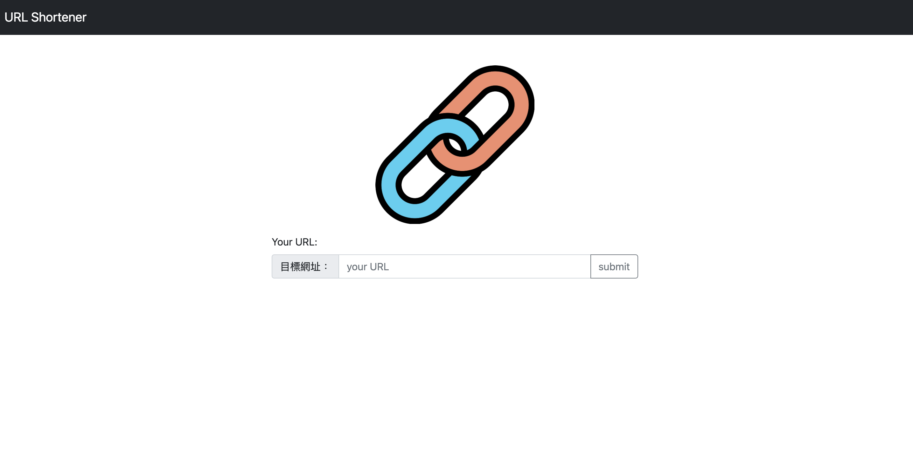
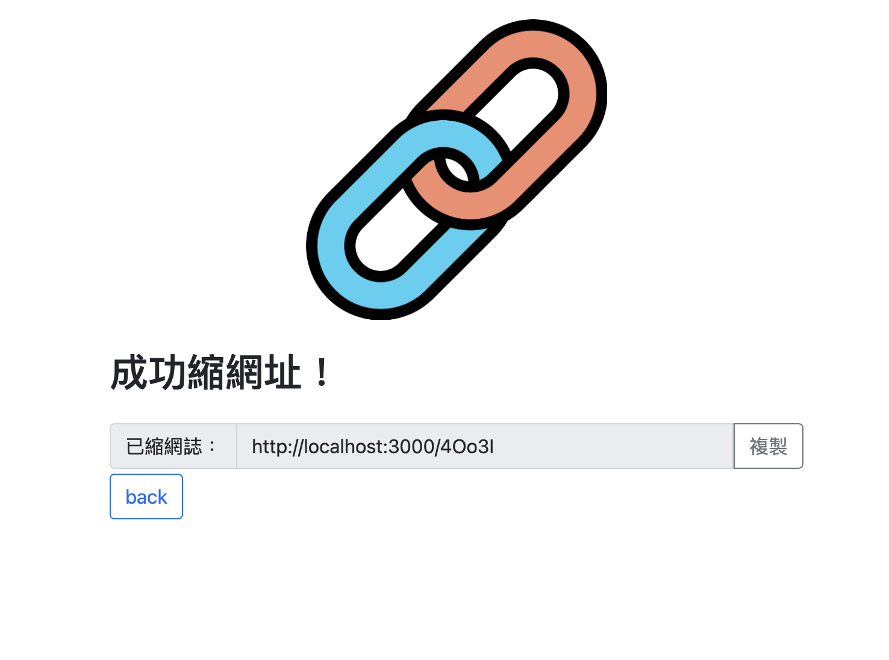

# URL shortener
a backend demo with Express.js, Node.js and MongoDB.

## Features
+ make a url with a shorter one.
+ with that shorter url, you can paste to browser and brows any validated web

## Environment
+ Node.js
+ npm
+ MongoDB
+ mongoose
+ nodemon

## Installation
1. copy and paste URL to your local terminal 
  ```
  git clone https://github.com/rayray1010/URL_shortener.git
  ```
2. install the dependencies 
  ```
  npm install
  ```
4. run the project and have fun!
```
npm run dev
```
## Example
### home page

### result
